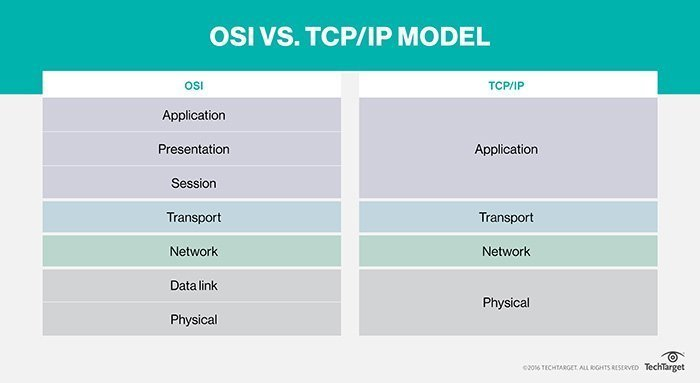

# Wireguard and Some poor networking concepts(for dumbs and dummies)

Even though WireGuard is a cutting-edge VPN solution, I will try to bring some core concepts of networking that are independent of any tunneling solutions. The idea isn't a deep dive into WireGuard, but try to cover your reason for existence and how it works.

## Introduction

WireGuard is next **next-generation secure network tunneling solution**. Created to replace IPSec and OpenVPN. Cutting-edge cryptography ensures the security and authenticity of your data using a **modern tunneling protocol.**

## Tunneling protocol

Tunneling is a **communication protocol**, that ensures that an amount of data will be sent from one destination to another. It can, for example, allow private network communication across a public network, through a process called encapsulation. The Tunneling uses a layered protocol model, such as the OSI or TCP/IP model.

## OSI Model

The process of sending data through a network involves a lot of pieces and steps, including hardware and software. The OSI model is a framework that creates some laws and rules to guarantee that all pieces will work together. To achieve that, the OSI model is divided into seven layers, each one with a specific function.

Today the most used model is the TCP/IP model, which was created to be more practical and simple than the OSI model.

## Resources

TODO read these resources

- [Wireguard](https://www.wireguard.com/)
- [Wireguard official paper](https://www.wireguard.com/papers/wireguard.pdf)
- [Tunneling Wikipedia](https://en.wikipedia.org/wiki/Tunneling_protocol)
- [How TailScale works](https://tailscale.com/blog/how-tailscale-works/)
